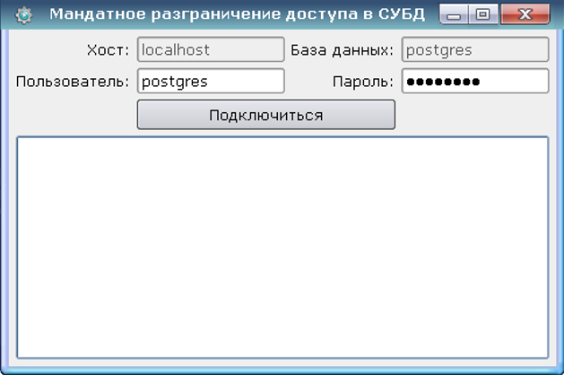
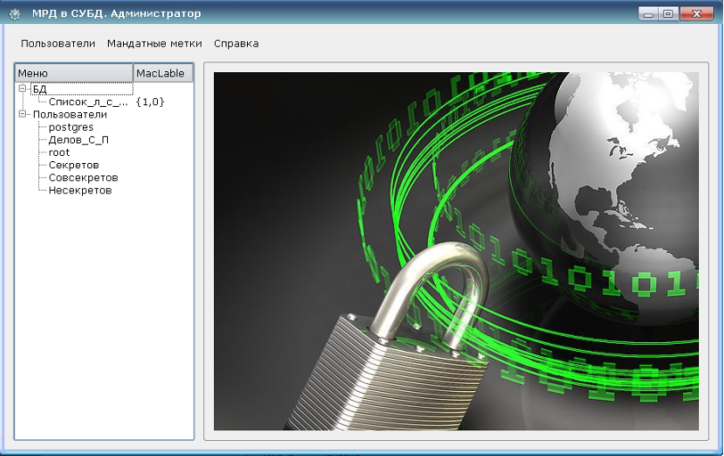
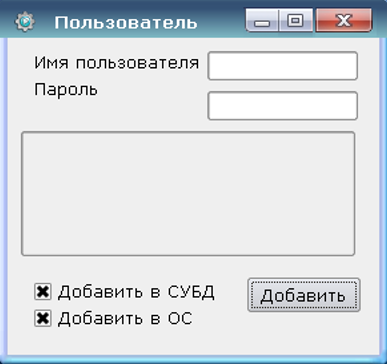
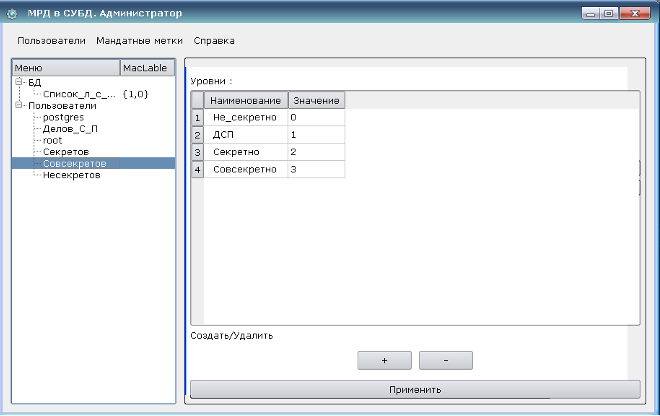
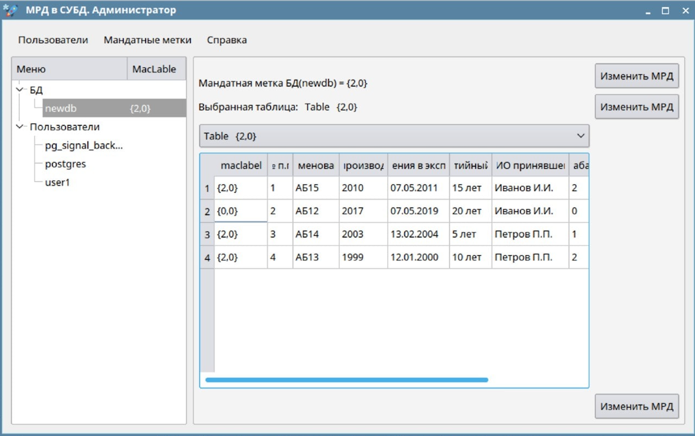
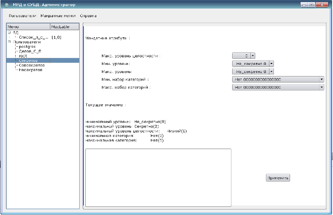

# pgAdminLite

Программа предназначена для администрирования мандатной политики безопасности в ОС Astra Linux SE 1.6.

Программа реализует: 
:white_check_mark: проверку прав доступа при подключении пользователя к кластеру БД;
:white_check_mark: установку минимального, максимального уровня конфиденциальности пользователя;
:white_check_mark: установку минимального, максимального категории пользователя;
:white_check_mark: определяет мандатный контекст безопасности пользователя;
:white_check_mark: определяет привилегии пользователя;
:white_check_mark: изменение мандатных атрибутов схем, табличных пространств, БД, таблиц, строк;
:white_check_mark: администрирование БД.

Программное обеспечение работает под управлением ОС Astra Linux Special Edition 1.6;

В качестве защищенной СУБД в составе ОС должна использоваться СУБД PostgreSQL версии 9.6;

В ОС должны быть настроены механизмы мандатного управления доступом и мандатного контроля целостности в соответствии с «Руководством по КСЗ. Часть 1»;

Для динамической (статической) сборки приложения использовалась IDE Qt Creator,  встроенная в ОС  Astra Linux Special Edition 1.6, как инструмент разработчика.

Для корректной работы ПО необходимо:
- одновременное наличие пользователей в ОС Astra Linux Special Edition 1.6 и в СУБД PostgreSQL;
- согласованность прав доступа пользователей (дискреционных и мандатных) в ОС Astra Linux Special Edition 1.6 и в СУБД PostgreSQL;
- установлено мандатное управление доступом к объектам и данным БД;
- установлен пароль и права доступа (дискреционные и мандатные) пользователя по умолчанию Postgres.
Элементы графического интерфейса пользователя проектируемого СПО реализованы в виде стандартных окон защищенного рабочего стола Fly.
При старте СПО отображается окно проверки прав доступа и подключения к заданной БД в СУБД PostgreSQL, элементы интерфейса:
- хост;
- база данных;
- пользователь;
- пароль.

Видеокадр окна пользовательского интерфейса подключения к БД

После реализации функций подключения к БД и проверки прав доступа пользователь СПО с правами администратора БД (специальная учетная запись) получает доступ к функциям управления атрибутами МРД сущностей БД и других пользователей БД, например назначать МРД атрибуты следующим сущностям БД: самой БД, таблицам, записям и пользователям ОС и БД, осуществлять модификацию МРД меток в ОС

Главная форма пользовательского интерфейса

Примеры видеокадров окон модулей контроля установленных значений МРД атрибутов БД, создания той или иной роли пользователя (обычный пользователь или администратор БД) изменения значений МРД уровней в подсистеме безопасности PARSEC , а так же управления и изменения значений МРД меток сущностей БД (рисунок 17) и пользователей СУБД представлены на рисунках

Видеокадр окна пользовательского интерфейса создания роли пользователя в ОС и СУБД

Видеокадр окна пользовательского интерфейса изменения значений МРД уровней в ОС

Видеокадр окна пользовательского интерфейса контроля и изменения значений МРД меток сущностей БД

Видеокадр окна пользовательского интерфейса контроля и изменения значений МРД меток пользователей БД

